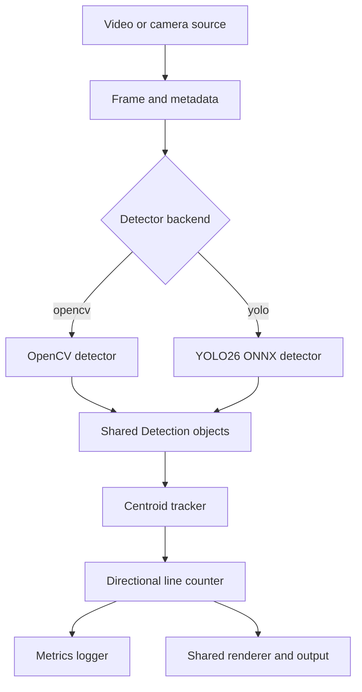

# Project Plan: CNN vs Rule-Based Conveyor Counter

## 1. Project goal

Build a small, reproducible Raspberry Pi 4 application that counts objects moving on a conveyor belt and compares two computer-vision approaches:

- **CNN mode:** YOLO26n exported to ONNX and executed with ONNX Runtime on the Raspberry Pi CPU.
- **Rule-based mode:** OpenCV thresholding, morphology, connected components or contours, and geometric filtering.

The experiment is intended to test the hypothesis that, for a controlled scene with bright, simple objects on a dark background, a conventional vision pipeline can achieve comparable counting accuracy at a higher frame rate and with lower resource usage than a modern neural detector.

This is a comparison of complete counting systems, not only two object detectors. Detection is the only mode-specific stage; tracking, crossing logic, rendering, inputs, outputs, and measurement must be shared.

## 2. Scope

### In scope

- Raspberry Pi 4 deployment.
- Recorded video, USB camera, or Raspberry Pi camera input.
- Bright objects with relatively simple shapes on a dark conveyor/background.
- One configurable counting line and one configured travel direction.
- Bounding boxes, track IDs, counting line, current count, FPS, and mode drawn on output video.
- Identical test videos, resolutions, regions of interest, counting rules, and metrics for both modes.
- CSV/JSON benchmark results and optional rendered result videos.
- CPU-only inference on the Raspberry Pi; no PyTorch dependency on the target device.

### Out of scope for the first version

- Multiple object classes with different counting rules.
- Re-identification after long occlusion.
- Multi-camera tracking.
- Conveyor control or PLC integration.
- Training on the Raspberry Pi.
- A graphical configuration interface.

## 3. Success criteria

The first version is complete when:

1. Both modes run through the same command-line application and configuration file.
2. Each mode can process the same recorded video and live camera source.
3. The output video displays bounding boxes, track IDs, the counting line, total count, mode, and processing FPS.
4. A tracked object is counted once when it crosses the line in the configured direction.
5. Benchmark runs produce accuracy, latency, throughput, CPU, and memory measurements in a machine-readable format.
6. The complete experiment can be installed and repeated on a Raspberry Pi 4 from documented instructions.
7. The final report explains where each method succeeds or fails instead of relying on FPS alone.

## 4. Fair-comparison rules

To isolate the detector choice, both modes must use:

- the same source frames and native input resolution;
- the same crop or region of interest;
- the same frame-skipping policy, normally none;
- the same `Detection` output contract;
- the same tracker, track-expiration settings, and line-crossing logic;
- the same warm-up and timed frame ranges;
- the same rendering setting for directly compared runs;
- identical output and evaluation code.

YOLO preprocessing can resize and letterbox internally to its configured input size, initially `320 x 320`. OpenCV may work at source resolution because that is part of the algorithm being evaluated. The benchmark must record both resolutions and separately report detector-only and complete-pipeline timing.

Two benchmark passes should be retained:

- **Headless pass (`--no-render`):** measures algorithm and pipeline performance without display/video-encoding overhead.
- **Rendered pass:** measures the user-visible application, including annotation and output encoding.

## 5. Architecture



### Design principle

Only the detector implementation changes between modes. Every detector returns the same domain objects, allowing the rest of the application to remain unaware of whether detections came from OpenCV or YOLO.

### Core contracts

```python
@dataclass(frozen=True)
class Frame:
    image: np.ndarray
    frame_id: int
    timestamp_s: float


@dataclass(frozen=True)
class Detection:
    bbox_xyxy: tuple[int, int, int, int]
    confidence: float
    class_id: int


class Detector(Protocol):
    def detect(self, frame: Frame) -> list[Detection]: ...
```

The OpenCV detector can use a synthetic confidence such as contour solidity or a fixed value. Downstream code must not depend on confidence semantics beyond optional filtering already performed by the detector.

### Main components

| Component | Responsibility |
|---|---|
| `VideoSource` | Read video/camera frames and attach monotonic frame IDs and timestamps. |
| `OpenCVDetector` | ROI, grayscale/HSV threshold, morphology, contour extraction, and shape/size filtering. |
| `YoloOnnxDetector` | Letterbox, normalize, ONNX Runtime inference, decode predictions, NMS if required, and rescale boxes. |
| `CentroidTracker` | Associate detections between frames, assign IDs, retain short histories, and expire missing tracks. |
| `LineCounter` | Detect a center-point side change and count one valid crossing per track in the configured direction. |
| `Renderer` | Draw identical overlays and write/display annotated frames. |
| `MetricsCollector` | Record stage latency, throughput, resource use, counts, configuration, and environment metadata. |
| `Evaluator` | Match predicted crossing events to ground truth and calculate accuracy metrics. |

## 6. Detection pipelines

### OpenCV rule-based detector

Initial pipeline:

1. Crop to the configured conveyor ROI.
2. Convert to grayscale or HSV.
3. Apply a fixed threshold; add adaptive thresholding only if lighting tests show it is necessary.
4. Use opening to remove isolated noise.
5. Use closing to fill small holes in objects.
6. Extract external contours or connected components.
7. Filter candidates by configurable area, width, height, aspect ratio, and optionally solidity.
8. Convert accepted candidates to the shared `Detection` format and restore full-frame coordinates.

The initial controlled setup should favor a fixed threshold because it is fast, explainable, and easy to reproduce. Parameters belong in `config.yaml`, not in source code.

### YOLO26 ONNX detector

Initial pipeline:

1. Export a trained YOLO26n model to ONNX on a development computer.
2. Validate the ONNX model against several reference images before moving it to the Pi.
3. Resize with letterboxing to `320 x 320` initially.
4. Normalize and arrange the tensor exactly as expected by the exported model.
5. Run CPU inference using ONNX Runtime.
6. Decode outputs and apply confidence filtering and NMS when these operations are not already included in the graph.
7. Transform coordinates back to the source frame and return shared `Detection` objects.

Start with FP32 for a reliable Raspberry Pi CPU baseline. Any later quantized model must be reported as a separate configuration rather than silently replacing the baseline.

## 7. Tracking and counting

A lightweight centroid tracker is sufficient for the controlled first experiment:

- associate detections using centroid distance and a maximum-distance gate;
- optionally add intersection-over-union as a tie-breaker;
- keep tracks alive for a small configurable number of missing frames;
- store recent centroid positions;
- expire stale tracks;
- never recycle an active track ID.

For each track, compute which side of the counting line its center occupies. Register a crossing only when:

1. the previous and current centers lie on different sides;
2. the movement is in the configured direction;
3. the track has not already been counted; and
4. the movement exceeds a small hysteresis margin around the line.

This shared temporal logic prevents a stationary object near the line from being counted repeatedly and prevents detection flicker from becoming multiple counts.

## 8. Configuration and CLI

All experiment-affecting settings should live in `config.yaml` and be copied into each result directory.

```yaml
source:
  width: 1280
  height: 720

counting:
  line_y: 420
  direction: top_to_bottom
  hysteresis_px: 8

tracking:
  max_distance_px: 80
  max_missing_frames: 8

opencv:
  color_space: gray
  threshold: 180
  min_area_px: 500
  max_area_px: 50000
  morphology_kernel: 5

yolo:
  model_path: models/yolo26n.onnx
  input_size: [320, 320]
  confidence_threshold: 0.35
  iou_threshold: 0.45

benchmark:
  warmup_frames: 30
  sample_resources_every_frames: 10
```

Planned command-line interface:

```bash
python app.py --mode opencv --source videos/sample.mp4
python app.py --mode yolo --source videos/sample.mp4
python app.py --mode yolo --source 0 --output results/videos/yolo_run.mp4
python app.py --mode opencv --source videos/sample.mp4 --no-render --benchmark
```

CLI arguments select the run; algorithm parameters remain in the versioned configuration. The application should fail early with clear messages for a missing model, unreadable source, unsupported execution provider, or invalid ROI/counting line.

## 9. Metrics and experiment protocol

### Counting quality

For every video, record:

- actual object count;
- predicted count;
- absolute count error: `abs(predicted - actual)`;
- count accuracy score: `max(0, 1 - abs(predicted - actual) / actual)` for a non-zero actual count;
- missed crossings;
- duplicate counts;
- false crossing events.

For stronger evaluation, annotate ground-truth crossing events with frame number or timestamp. Match a predicted event to at most one ground-truth event of the same direction within a fixed tolerance, then report:

- crossing-event precision;
- crossing-event recall;
- crossing-event F1;
- median absolute crossing-time error.

Count accuracy alone is insufficient because a miss and a false positive can cancel each other in the final total.

### Performance

Use `time.perf_counter_ns()` around each stage and report:

- detector latency: median and P95 milliseconds;
- complete processing latency: median and P95 milliseconds;
- detector throughput FPS;
- complete processing FPS;
- end-to-end live FPS when using a camera;
- CPU utilization percentage;
- resident memory in MB;
- input/read, tracking/counting, rendering, and encoding time where applicable.

FPS should be measured over the timed run, not inferred only from a single-frame latency. With a strictly sequential pipeline, `1000 / mean_latency_ms` is a useful consistency check, but it is not a substitute for measured throughput.

Exclude configured warm-up frames from all reported timing. Save raw per-frame metrics to CSV and the run summary to JSON. Each summary must include:

- Git commit;
- date and run ID;
- mode and full configuration;
- source-video identity;
- Raspberry Pi model and RAM;
- OS, kernel, Python, OpenCV, NumPy, and ONNX Runtime versions;
- ONNX execution provider and model hash;
- cooling, power supply, CPU governor, temperature, and throttling status.

### Test-video suite

Record the same scene in progressively harder conditions:

| Scenario | Variable under test |
|---|---|
| Ideal baseline | Stable lighting, high contrast, separated objects, moderate speed. |
| Conveyor speed | Slow, medium, and fast motion. |
| Object spacing | Wide spacing to nearly touching objects. |
| Lighting | Brightness changes, shadows, and mild flicker. |
| Contrast | Objects increasingly similar to the background. |
| Overlap | Partial occlusion or touching objects. |
| Appearance | Modest variations in object color, size, and orientation. |

Each video should have a fixed camera, known native resolution and FPS, a documented actual count, and manually verified crossing-event labels. Both modes must read the exact same files rather than separate live runs.

Run each configuration at least three times. Report the median run and variation across runs. Randomize mode order where practical, allow the Pi to return to a similar thermal state, and check throttling before and after each run.

## 10. Planned repository structure

```text
cnn-vs-rulebasd/
├── app.py
├── config.yaml
├── README.md
├── PROJECT_PLAN.md
├── requirements.txt
├── models/
│   └── yolo26n.onnx
├── src/
│   ├── video/
│   │   ├── base.py
│   │   └── opencv_source.py
│   ├── detection/
│   │   ├── base.py
│   │   ├── opencv_detector.py
│   │   └── yolo_onnx_detector.py
│   ├── counting/
│   │   ├── tracker.py
│   │   └── line_counter.py
│   ├── visualization/
│   │   └── renderer.py
│   └── benchmark/
│       ├── metrics.py
│       └── evaluator.py
├── videos/
├── ground_truth/
├── results/
│   ├── raw/
│   ├── videos/
│   └── figures/
└── tests/
    ├── test_detectors.py
    ├── test_tracker.py
    ├── test_line_counter.py
    └── test_metrics.py
```

Large ONNX models, input videos, and generated results should not be committed directly unless Git LFS is intentionally configured. Keep small test fixtures in the repository and document how to obtain larger artifacts.

## 11. Testing strategy

### Unit tests

- Bounding boxes are valid, clipped to frame bounds, and use one coordinate convention.
- Empty frames return an empty detection list without failing.
- OpenCV and YOLO implementations satisfy the same detector contract.
- A synthetic track crossing the line in the valid direction is counted once.
- A track moving in the wrong direction is not counted.
- A stationary or jittering track inside the hysteresis zone is not counted.
- Expired tracks are removed at the configured time.
- Frame IDs and timestamps remain monotonic.
- Warm-up frames are excluded from benchmark summaries.

### Integration tests

- A short synthetic video runs end to end in OpenCV mode.
- A small ONNX test model or the real model runs end to end in YOLO mode.
- Rendered and headless processing produce the same counts.
- Repeated processing of a recorded video produces deterministic counts.
- CSV and JSON outputs contain all required fields.

### Raspberry Pi acceptance test

- Fresh environment installation succeeds from the documented commands.
- Both modes process the baseline video without crashes or unbounded memory growth.
- Camera input and output recording work.
- The Pi does not report undervoltage or thermal throttling during the official run.

## 12. Raspberry Pi deployment

Target a supported 64-bit Raspberry Pi OS release and use a virtual environment. The deployment bundle consists of:

- application source;
- pinned `requirements.txt`;
- `config.yaml`;
- the exported ONNX model;
- sample or download instructions for test data;
- run and benchmark instructions.

Keep target dependencies minimal: ONNX Runtime, OpenCV, NumPy, PyYAML, `psutil`, and the test runner. Do not install PyTorch on the Raspberry Pi for inference.

Before official measurements:

1. Use an adequate power supply.
2. Fit active cooling and document it.
3. disable unrelated background workloads where practical;
4. record the CPU governor and clock behavior;
5. verify no undervoltage or thermal-throttling flags;
6. run a warm-up before collecting timed samples.

## 13. Implementation milestones

### Phase 1 — Application shell and video I/O

- Create package structure, configuration loader, CLI, and `VideoSource`.
- Support file and camera inputs plus clean end-of-stream/shutdown behavior.

**Exit criterion:** the app reads a source and can copy or display all frames with correct frame IDs and timestamps.

### Phase 2 — Shared detection contract

- Implement domain types and `Detector` protocol.
- Add detector selection by `--mode` and validation for detections.

**Exit criterion:** a stub detector can be swapped without changing the processing loop.

### Phase 3 — OpenCV detector

- Implement ROI, thresholding, morphology, contour extraction, and configurable filtering.
- Add unit tests using synthetic shapes and noise.

**Exit criterion:** baseline objects receive stable boxes under ideal conditions.

### Phase 4 — Shared tracker and line counter

- Implement centroid association, expiration, directional crossing, hysteresis, and one-count-per-track state.
- Test normal, reverse, missing-frame, and jitter cases.

**Exit criterion:** synthetic trajectories produce the expected event sequence and count.

### Phase 5 — Complete OpenCV mode

- Connect detection, tracking, counting, renderer, and video writer.
- Tune only on a designated development video.

**Exit criterion:** an annotated video shows stable IDs and the correct baseline count.

### Phase 6 — YOLO26 ONNX mode

- Prepare or train YOLO26n, export it, and validate ONNX output on a development machine.
- Implement preprocessing, inference, decoding/NMS, and coordinate restoration.

**Exit criterion:** YOLO mode passes the same interface tests and yields correct boxes on reference frames.

### Phase 7 — Benchmark instrumentation

- Add per-stage timers, warm-up handling, resource sampling, environment capture, CSV output, and JSON summaries.
- Support headless and rendered benchmark passes.

**Exit criterion:** repeated runs produce complete, machine-readable metrics without changing counts.

### Phase 8 — Ground truth and experiment suite

- Record and version the video manifest.
- Annotate actual counts and crossing events.
- Implement event matching and accuracy summaries.

**Exit criterion:** both modes can be evaluated automatically on every scenario.

### Phase 9 — Raspberry Pi deployment and official runs

- Pin compatible dependencies, document installation, and verify camera support.
- Run both modes in randomized order with thermal and throttling checks.

**Exit criterion:** at least three valid runs per mode/scenario are stored with environment metadata.

### Phase 10 — Analysis and report

- Aggregate results and create count-quality, latency, FPS, CPU, and RAM comparisons.
- Analyze failure cases by scenario and distinguish detector, tracking, and counting errors.

**Exit criterion:** the conclusion states the operating conditions in which each approach is preferable and whether the original hypothesis is supported.

## 14. Main risks and mitigations

| Risk | Mitigation |
|---|---|
| Touching objects merge into one OpenCV contour. | Improve spacing, use distance-transform/watershed only as a documented variant, and retain the difficult test. |
| Detection flicker causes duplicate counts. | Shared tracking, crossing hysteresis, one-count-per-track state, and event-level evaluation. |
| YOLO output/export format differs by tool version. | Pin exporter/runtime versions and test output shapes and coordinate restoration explicitly. |
| Pi thermal throttling distorts results. | Active cooling, warm-up, temperature/throttling logging, randomized order, and invalidation of throttled official runs. |
| Rendering hides detector performance differences. | Report separate headless and rendered passes plus per-stage latency. |
| Parameters are overfit to the test set. | Tune on a separate development video and freeze configuration before official evaluation. |
| Final totals hide offsetting misses and false positives. | Use timestamped crossing events with precision, recall, and F1 in addition to count error. |
| Model/video files make the repository too large. | Use documented downloads or Git LFS and commit only small fixtures. |

## 15. Expected final deliverables

- Reproducible source code for both modes.
- Exported YOLO26n ONNX model or documented model-download/export procedure.
- Versioned configuration and dependency lock/pins.
- Labeled test-video manifest and ground-truth crossing events.
- Annotated output videos from both modes.
- Raw CSV metrics and JSON run summaries.
- Comparison figures and a concise experimental report.
- Raspberry Pi setup and reproduction instructions.

The most important outcome is not simply selecting a winner. The project should show how controlled scene design changes the amount of model complexity and hardware required for reliable computer vision.
