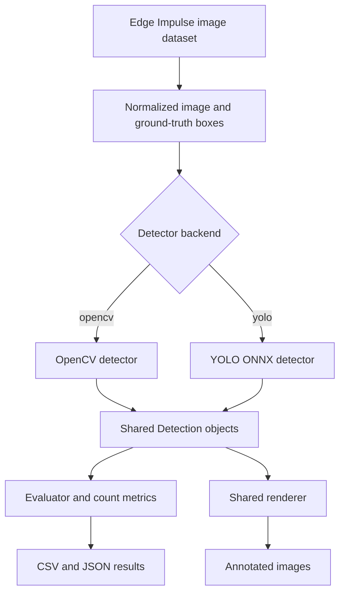

# Project Plan: CNN vs Rule-Based Conveyor Image Counter

## 1. Goal

Build a reproducible Raspberry Pi 4 application that detects and counts
objects in annotated still images from a real conveyor, then compare:

- **CNN mode:** YOLO26n exported to ONNX and run with ONNX Runtime on CPU.
- **Rule-based mode:** OpenCV thresholding, morphology, contours, and geometric
  filtering.

The experiment tests whether a controlled conveyor scene with a simple,
high-contrast object class can be handled accurately and faster by traditional
vision on limited hardware.

This version evaluates spatial detection and per-image count. It deliberately
does not claim to evaluate temporal tracking or line-crossing counts.

## 2. Dataset

Use Edge Impulse's
[Cubes on conveyor belt (colors)](https://docs.edgeimpulse.com/datasets/image/cubes-on-conveyor-belt-colors)
object-detection dataset, licensed under BSD 3-Clause Clear. Download the
Hugging Face mirror at the pinned commit
`e3d1c8b0c4872b70fcd77d86dec3bde7875e6054`.

| Property | Validated pinned-snapshot value |
|---|---:|
| Images | 70 |
| Training images | 55 |
| Testing images | 15 |
| Bounding boxes | 156 |
| Source classes | 4 (`blue`, `green`, `red`, `yellow`) |
| Evaluation class | 1 (`cube`) |
| Objects per image | 1–4 |

The experiment collapses all four color labels into one `cube` class. This
keeps the comparison focused on detecting and counting physical objects; the
OpenCV baseline is not required to classify their colors.

### Initial evaluation policy

- Download and validate the pinned snapshot with `scripts/download_dataset.py`.
- Treat `testing` and its `bounding_boxes.labels` manifest as the frozen
  evaluation split.
- Tune OpenCV parameters on training images only.
- Train YOLO outside the Raspberry Pi using training data only.
- Do not adjust either method after examining testing failures.
- Clearly label all results as a 15-image smoke benchmark.

### Required follow-up for a final experiment

The public split is small, and filenames/content indicate related capture
sequences. Before drawing a strong conclusion, collect or construct a larger
group-wise train/development/test split. Frames from the same capture sequence
must remain in one group to prevent near-neighbor leakage. Freeze all parameters
before running the held-out test set.

## 3. Scope

### In scope

- Raspberry Pi 4 CPU inference.
- Edge Impulse object-detection image directories and JSON annotations.
- One evaluation class: cube, collapsed from four source color labels.
- Bounding-box and per-image count evaluation.
- Annotated output images with predicted boxes, confidence, mode, count, and
  latency.
- Headless and rendered benchmarks.
- CSV/JSON metrics and run metadata.
- Identical images, order, preprocessing policy, evaluation, and output
  contract for both detectors.

### Out of scope for this version

- Video input and camera input.
- Object tracking and track IDs.
- Directional line crossing.
- Counting the same physical object once across several frames.
- Temporal video input and a corresponding inference-FPS claim. The app may
  create a slideshow-style MP4 from annotated test images for visual review.
- Color classification.
- Training on the Raspberry Pi.

## 4. Success criteria

The image-based first version is complete when:

1. The deployment command downloads and validates the pinned dataset.
2. Both modes process the same selected split through one CLI.
3. Both modes return the same `Detection` data structure.
4. Output images display predicted boxes, mode, per-image count, and latency.
5. Evaluation reads Edge Impulse ground-truth boxes rather than detector output.
6. Results include detection quality, count quality, latency, throughput, CPU,
   and memory usage.
7. Runs can be reproduced on a fresh Raspberry Pi 4 from documented commands.
8. Conclusions clearly separate smoke-test evidence from a later held-out test.
9. Each run creates a short review MP4 without treating it as temporal-video
   evidence.

## 5. Architecture



Only the detector changes between modes. Dataset loading, box conventions,
evaluation, rendering, output writing, and performance measurement are shared.

### Core contracts

```python
@dataclass(frozen=True)
class ImageSample:
    image: np.ndarray
    image_id: str
    source_path: Path
    ground_truth: tuple["GroundTruthBox", ...]


@dataclass(frozen=True)
class Detection:
    bbox_xyxy: tuple[int, int, int, int]
    confidence: float
    class_id: int


class Detector(Protocol):
    def detect(self, sample: ImageSample) -> list[Detection]: ...
```

Use zero-based, half-open pixel boxes `[x1, y1, x2, y2)` internally. Convert
Edge Impulse `[x, y, width, height]` boxes once in the dataset loader, scale them
with the shared image normalization, collapse color labels to class 0, and clip
all boxes to image bounds.

### Components

| Component | Responsibility |
|---|---|
| `EdgeImpulseImageDataset` | Enumerate a split, decode images, parse JSON boxes, collapse colors to `cube`, and produce deterministic IDs/order. |
| `OpenCVDetector` | Threshold, morphology, contour extraction, and shape/size filtering. |
| `YoloOnnxDetector` | Letterbox, normalize, run ONNX, decode predictions, NMS, and restore coordinates. |
| `Evaluator` | Match predictions to ground truth and compute detection/count metrics. |
| `Renderer` | Draw consistent predicted boxes, labels, counts, and timing. |
| `MetricsCollector` | Record per-image stage latency, CPU, memory, and run metadata. |
| `ResultWriter` | Write annotated images, raw CSV, and summary JSON. |

## 6. Detector pipelines

### OpenCV mode

Initial pipeline:

1. Decode the image and apply the shared resize to 640×480.
2. Convert to HSV.
3. Combine fixed red, yellow, green, and blue color masks selected using
   training images.
4. Apply opening to suppress isolated noise.
5. Apply closing to fill small gaps inside each cube mask.
6. Extract external contours or connected components.
7. Filter by area, width, height, aspect ratio, solidity, and rectangularity.
8. Return clipped boxes through the shared contract as class 0 (`cube`).

All parameters belong in `config.yaml`. The testing images must not be used
for manual threshold selection.

### YOLO ONNX mode

1. Fine-tune YOLO26n on a development machine using only the training split.
2. Export FP32 ONNX for the initial Raspberry Pi baseline.
3. Validate ONNX output against reference images before deployment.
4. Use the same shared 640×480 normalized image as OpenCV and export the ONNX
   model for a 640×480 input.
5. Run ONNX Runtime with the CPU execution provider.
6. Decode outputs, apply confidence filtering and NMS if needed.
7. Return detections in the shared 640×480 coordinate system.

Quantized models must be reported as separate configurations rather than
silently replacing the FP32 baseline.

## 7. Configuration and CLI

Example configuration:

```yaml
dataset:
  root: datasets/cubes-on-conveyor-belt
  split: testing
  source_class_names: [blue, green, red, yellow]
  evaluation_class_names: [cube]
  normalized_size: [640, 480]

opencv:
  color_space: hsv
  color_ranges:
    red: [[0, 80, 60], [10, 255, 255]]
    yellow: [[18, 80, 60], [38, 255, 255]]
    green: [[38, 60, 40], [90, 255, 255]]
    blue: [[90, 60, 40], [135, 255, 255]]
  morphology_kernel: 5
  min_area_px: 500
  max_area_px: 100000
  min_solidity: 0.75

yolo:
  model_path: models/yolo26n-cube.onnx
  input_size: [640, 480]
  confidence_threshold: 0.35
  iou_threshold: 0.45

evaluation:
  match_iou: 0.50

benchmark:
  warmup_images: 15
  repetitions: 20
  resource_sample_every_images: 5
```

Planned CLI:

```bash
python app.py --mode opencv --dataset datasets/cubes-on-conveyor-belt --split testing
python app.py --mode yolo --dataset datasets/cubes-on-conveyor-belt --split testing
python app.py --mode opencv --dataset datasets/cubes-on-conveyor-belt --split testing --benchmark --no-render
python app.py --mode yolo --dataset datasets/cubes-on-conveyor-belt --split testing --output results/yolo-testing
```

## 8. Metrics

### Detection quality

Match each prediction to at most one ground-truth box of the same class. Report:

- precision, recall, and F1 at IoU 0.50;
- AP@0.50;
- mAP@0.50:0.95 when the evaluator supports it;
- mean matched-box IoU;
- false-positive and false-negative counts.

### Count quality

For image `i`, let `g_i` be the number of entries in its ground-truth box array
and `p_i` the number of accepted predictions. Report:

- mean absolute count error: `mean(abs(p_i - g_i))`;
- exact-count accuracy: fraction of images where `p_i == g_i`;
- total absolute count error: `abs(sum(p_i) - sum(g_i))`;
- undercounted and overcounted image counts.

Count metrics alone are insufficient because offsetting false positives and
misses can produce the correct total. Always publish detection metrics too.

### Performance

Report separately:

- image decode latency;
- detector preprocessing latency;
- inference or OpenCV detection latency;
- postprocessing latency;
- complete pipeline latency;
- median and P95 milliseconds per image;
- sustained images per second over repeated passes;
- CPU utilization and resident memory;
- rendering and image-encoding time when enabled.

This throughput is **images per second**, not temporal video FPS. Repeating the
small testing split is allowed for stable timing but must not multiply its
accuracy sample size.

## 9. Fair-comparison rules

Both modes must use:

- the same image files in the same deterministic order;
- the same shared 640×480 normalized input and box transform;
- the same class mapping and ground-truth parser;
- the same internal box coordinate convention;
- the same IoU matching and metric implementation;
- the same rendering setting for directly compared runs;
- batch size 1;
- no frame or image skipping;
- the same warm-up policy and number of timed repetitions.

Decode and shared-resize time must be measured separately from detector time.
Both detector timers begin with the same 640×480 image; neither may perform an
unreported additional resize. Record all processing resolutions in every result.

Retain two benchmark passes:

- **Headless:** algorithm and pipeline timing without drawing/encoding.
- **Rendered:** user-visible output including annotation and file encoding.

## 10. Result records

Save raw per-image results to CSV and a run summary to JSON. Include:

- Git commit and run ID;
- detector mode and complete configuration;
- dataset provider, mirror, pinned revision, annotation format, and split;
- image filenames and label counts;
- Raspberry Pi model, RAM, OS, kernel, and Python version;
- OpenCV, NumPy, ONNX Runtime, and model/export versions;
- ONNX file hash and execution provider;
- CPU governor, temperature, cooling, power supply, and throttling state;
- all quality and performance metrics.

## 11. Planned repository structure

```text
cnn-vs-rulebasd/
├── app.py
├── config.yaml
├── README.md
├── PROJECT_PLAN.md
├── THIRD_PARTY_NOTICES.md
├── requirements.txt
├── data/
│   └── dataset_sources.json
├── scripts/
│   └── download_dataset.py
├── datasets/                 # deployment download; ignored by Git
├── models/
│   └── yolo26n-cube.onnx
├── src/
│   ├── data/
│   │   └── edge_impulse_image_dataset.py
│   ├── detection/
│   │   ├── base.py
│   │   ├── opencv_detector.py
│   │   └── yolo_onnx_detector.py
│   ├── evaluation/
│   │   ├── box_matching.py
│   │   └── metrics.py
│   ├── visualization/
│   │   └── renderer.py
│   └── benchmark/
│       └── collector.py
├── results/
│   ├── raw/
│   ├── images/
│   └── summaries/
└── tests/
    ├── test_dataset.py
    ├── test_detectors.py
    ├── test_box_matching.py
    └── test_metrics.py
```

## 12. Testing

### Unit tests

- Edge Impulse XYWH boxes convert correctly to scaled, clipped XYXY boxes.
- All four color labels map to the single evaluation class `cube`.
- Missing images, labels, models, or classes fail with clear messages.
- Empty label files and empty predictions are handled correctly.
- Both detectors satisfy the same output contract.
- Matching is one-to-one and respects the IoU threshold.
- Count MAE and exact-count accuracy match hand-calculated fixtures.
- Timing warm-up passes do not affect accuracy sample counts.

### Integration tests

- Each mode processes the complete testing split.
- Headless and rendered passes produce identical predictions and metrics.
- Repeated benchmark passes do not duplicate accuracy records.
- Output images and CSV/JSON summaries contain required fields.
- A second run with unchanged inputs produces deterministic OpenCV results.

### Raspberry Pi acceptance test

- Fresh installation and dataset download succeed from documented commands.
- The downloaded export validates before inference starts.
- Both modes complete repeated headless and rendered runs.
- Memory usage remains bounded.
- No official run reports undervoltage or thermal throttling.

## 13. Milestones

1. **Dataset preparation:** implement download, validation, label parsing, and
   deterministic iteration.
2. **Shared contracts:** create `ImageSample`, `Detection`, and backend protocol.
3. **OpenCV detector:** implement and tune only on training images.
4. **Evaluation:** implement one-to-one box matching and count metrics.
5. **Renderer and outputs:** create annotated images, CSV, and JSON.
6. **YOLO ONNX:** fine-tune/export externally and implement Pi inference.
7. **Benchmarking:** add stage timers, resource capture, warm-up, and repeats.
8. **Pi validation:** run both modes under recorded thermal conditions.
9. **Dataset upgrade:** create a leakage-safe held-out test split.
10. **Final analysis:** repeat experiments on the held-out set and document
    failure cases.

## 14. Risks and mitigations

| Risk | Mitigation |
|---|---|
| Fifteen testing images give unstable accuracy estimates. | Treat the published split as a smoke test and create a larger held-out set before final claims. |
| Related frames leak across evaluation splits. | Group all frames from the same capture sequence when creating new splits. |
| OpenCV parameters overfit the small sample. | Tune only on training images and freeze configuration before evaluation. |
| The clean scene is easier than many industrial conveyors. | State that the conclusion applies to controlled, high-contrast conditions and later add harder real scenes. |
| YOLO training data is too small. | Use transfer learning, document augmentations, and evaluate only on held-out originals. |
| Thresholding is sensitive to lighting or belt contamination. | Analyze failures explicitly and add harder real scenes later. |
| Repeated timing is mistaken for more accuracy data. | Deduplicate accuracy by image ID; repetitions affect timing only. |
| Pi throttling distorts performance. | Use active cooling and record temperature/throttling before and after runs. |
| Upstream data changes silently. | Fetch the exact commit hash and validate expected image, box, and class counts. |

## 15. Expected deliverables

- Reproducible dataset downloader and source manifest.
- Image-dataset loader with Edge Impulse JSON annotation parsing and a
  color-to-`cube` class mapping.
- OpenCV and YOLO ONNX detector implementations.
- Annotated output images from both modes.
- Detection and count evaluation code.
- Raw per-image metrics and run summaries.
- Raspberry Pi setup instructions.
- A smoke-test report with explicit statistical limitations.
- A later held-out evaluation suitable for the final conclusion.
