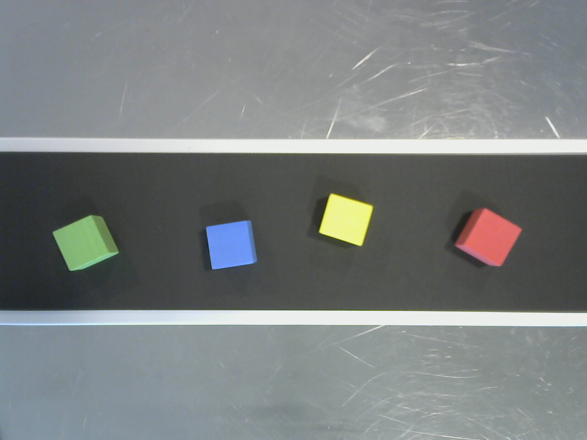

# CNN vs Rule-Based Object Counter

This repository implements a Raspberry Pi 4 experiment comparing two approaches on
annotated images from a real conveyor:

1. YOLO26n inference through ONNX Runtime on the CPU.
2. Traditional OpenCV color thresholding, morphology, and contour detection.

Both modes receive the same normalized images and return the same bounding-box
contract. Their boxes and per-image object counts are evaluated against the
provided annotations. See [PROJECT_PLAN.md](PROJECT_PLAN.md) for the complete
experimental protocol.

The first working version is implemented. It loads Edge Impulse annotations,
runs either backend, calculates shared detection/count metrics, writes annotated
images, and creates an MP4 review sequence from the still-image test split.

## Dataset

The baseline input is Edge Impulse's
[Cubes on conveyor belt (colors)](https://docs.edgeimpulse.com/datasets/image/cubes-on-conveyor-belt-colors)
object-detection dataset. It contains real, top-down conveyor images with
clearly separated blue, green, red, and yellow cubes on a dark belt. The source
dataset is licensed under
[BSD 3-Clause Clear](https://spdx.org/licenses/BSD-3-Clause-Clear.html).

For reproducible deployment, the downloader uses Edge Impulse's
[Hugging Face mirror](https://huggingface.co/datasets/edgeimpulse/cubes-on-conveyor-belt)
at commit
[`e3d1c8b`](https://huggingface.co/datasets/edgeimpulse/cubes-on-conveyor-belt/commit/e3d1c8b0c4872b70fcd77d86dec3bde7875e6054).
The pinned snapshot has:

| Property | Value |
|---|---:|
| Images | 70 |
| Training images | 55 |
| Testing images | 15 |
| Bounding boxes | 156 |
| Objects per image | 1–4 |
| Source labels | `blue`, `green`, `red`, `yellow` |
| Evaluation label | `cube` (all colors combined) |

### Example data image

The following downloaded training image has four annotated, spatially
separated cubes. Its ground-truth count is **4**.



Image source: Edge Impulse, *Cubes on conveyor belt (colors)* dataset. A local
copy is included only as a documented preview; the complete dataset is fetched
during deployment.

### Deployment download

The complete dataset is not committed to this repository. Install Git LFS and
run the pinned downloader:

```bash
sudo apt-get update
sudo apt-get install -y git git-lfs
git lfs install

python3 scripts/download_dataset.py
```

No account or API key is required. The command downloads the exact pinned
revision, verifies all image/annotation pairs, checks that LFS images were
materialized, and confirms the expected splits, classes, and box count. It
writes non-secret provenance metadata to:

```text
datasets/cubes-on-conveyor-belt/.source.json
```

The command is idempotent: an existing valid dataset is checked and reused.
Dataset facts and limitations are versioned in
[`data/dataset_sources.json`](data/dataset_sources.json), and attribution is in
[THIRD_PARTY_NOTICES.md](THIRD_PARTY_NOTICES.md).

## Ground truth and metrics

Each split contains a `bounding_boxes.labels` JSON manifest. For a given image,
the number of objects in its `boundingBoxes[filename]` array is the true cube
count. Color labels are collapsed to a single `cube` class for a fair comparison
because the experiment measures object detection and counting, not color
classification.

This supports:

- bounding-box precision, recall, F1, and mAP;
- mean absolute count error per image;
- percentage of images with an exactly correct count;
- total predicted boxes versus total ground-truth boxes;
- median/P95 latency and sustained images per second.

The annotations are independent of both detector outputs, so neither method
defines its own truth.

## Limitations

These are annotated still images, not a documented ordered video sequence.
They cannot evaluate tracking, line crossings, duplicate temporal counts, or
video playback FPS. The first application version will output annotated images
and a metrics summary.

The 15-image testing split is appropriate for a smoke benchmark but too small
for a strong general claim. Several images also appear to come from related
capture sequences, so the published split may contain near-neighbor leakage.
Report this limitation and use a larger, capture-grouped held-out set before
publishing definitive accuracy conclusions.

## Setup

Python 3.11 or newer is required.

```bash
python3 -m venv .venv
.venv/bin/pip install -e ".[dev]"
.venv/bin/python scripts/download_dataset.py
```

On Windows, replace `.venv/bin/` with `.venv\\Scripts\\`.

## Run the OpenCV baseline

```bash
.venv/bin/python app.py \
  --mode opencv \
  --dataset datasets/cubes-on-conveyor-belt \
  --split testing
```

Outputs are written to `results/opencv-testing/`:

- `summary.json` — aggregate detection, count, and timing metrics;
- `results.csv` — per-image counts and detector latency;
- `images/` — annotated test images;
- `opencv-testing-review.mp4` — two seconds per annotated image.

The MP4 is only a convenient visual review of still-image results. Its playback
rate is not a video-inference FPS measurement.

## Train and run YOLO26n

Training is done on a development machine, never on the Raspberry Pi. The
script converts only the source `training` split to YOLO format, makes a
deterministic 44/11 train/validation split, fine-tunes YOLO26n, and exports the
default end-to-end ONNX output at 640×480.

```bash
.venv/bin/pip install -e ".[train]"
.venv/bin/python scripts/train_yolo.py --epochs 50
.venv/bin/python app.py \
  --mode yolo \
  --dataset datasets/cubes-on-conveyor-belt \
  --split testing
```

The trained weights are intentionally not committed. The expected inference
model path is `models/yolo26n-cube.onnx`.

## Current smoke-test result

The initial implementation check below used the frozen 15-image public test
split and a 50-epoch YOLO26n run. Timings are from the development environment,
not a Raspberry Pi 4, so they are only implementation checks.

| Metric | OpenCV | YOLO26n ONNX |
|---|---:|---:|
| True positives / ground truth | 35 / 35 | 33 / 35 |
| Precision | 100% | 89.2% |
| Recall | 100% | 94.3% |
| F1 | 100% | 91.7% |
| Exact-count images | 15 / 15 | 11 / 15 |
| Mean matched IoU | 0.825 | 0.923 |

Run the actual performance benchmark again on the Raspberry Pi; do not compare
the development-machine latency numbers against future Pi measurements.

## Tests

```bash
.venv/bin/python -m pytest -q
```

## Road-vehicle experiment

The second experiment deliberately moves beyond the controlled cube scene. It
uses PaddleX's small COCO-format vehicle example derived from the
[UA-DETRAC road-traffic benchmark](https://arxiv.org/abs/1511.04136). UA-DETRAC
contains real fixed-camera traffic sequences with vehicle boxes; its full
benchmark has more than 140,000 frames. The compact example used here contains
500 training and 100 validation frames. Only the ordered 100-frame validation
sequence is evaluated.

The application architecture is unchanged:

- both methods receive the same 640×480 frames;
- both return the existing shared `Detection` box contract;
- the same IoU matcher, per-frame count evaluator, renderer, CSV writer, and
  MP4 writer are reused;
- only the dataset adapter and the OpenCV scene method are selected by
  `configs/road.yaml`.

The two methods are:

1. **YOLO26n ONNX** with pretrained COCO weights and the COCO road classes
   `car`, `motorcycle`, `bus`, and `truck`. It is **not fine-tuned** on
   UA-DETRAC.
2. **OpenCV MOG2** background subtraction, shadow removal, morphology, and
   contour filtering. This is intentionally a simple fixed-camera baseline.

This is a useful counterexample to the cube result. Vehicle appearance, scale,
occlusion, and stopped/slow traffic are semantic problems. Motion subtraction
can be fast, but it can merge nearby cars, fragment a car, or absorb a stopped
car into the background.

### Run it locally

```bash
.venv/bin/pip install -e ".[dev,train]"
.venv/bin/python scripts/download_road_dataset.py
.venv/bin/python scripts/export_yolo26_vehicle.py

.venv/bin/python app.py \
  --mode opencv \
  --config configs/road.yaml \
  --dataset datasets/vehicle-coco-examples \
  --split val \
  --output results/road-opencv

.venv/bin/python app.py \
  --mode yolo \
  --config configs/road.yaml \
  --dataset datasets/vehicle-coco-examples \
  --split val \
  --output results/road-yolo

.venv/bin/python scripts/compare_results.py \
  --opencv results/road-opencv/summary.json \
  --yolo results/road-yolo/summary.json
```

The outputs include one annotated 10 FPS MP4 per method, per-frame CSV files,
JSON summaries, and a Markdown comparison. The videos show both the predicted
and ground-truth vehicle counts.

The GitHub Actions workflow `.github/workflows/road-benchmark.yml` runs the
same commands on a clean CPU runner and publishes the videos and metrics as one
downloadable artifact.

### Interpretation limits

This remains a per-frame detection/count benchmark, matching the cube
experiment. It does not yet track identities or report the number of unique
cars crossing a line. Adding a shared tracker and line-crossing counter should
be treated as a separate third experiment, because it introduces association
errors beyond detector quality.

The UA-DETRAC-derived sample is published for research benchmarking. Consult
the upstream terms before commercial redistribution; the complete dataset,
weights, and generated videos are not committed here.

