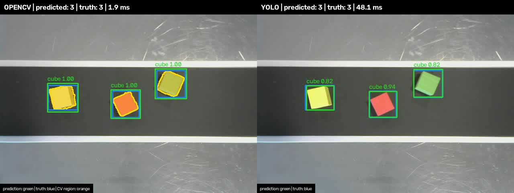
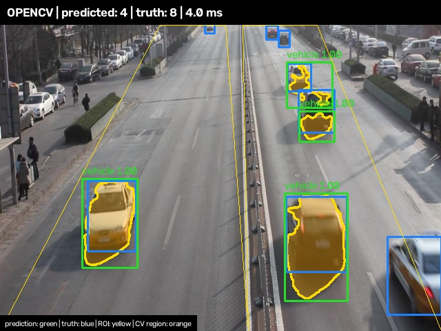
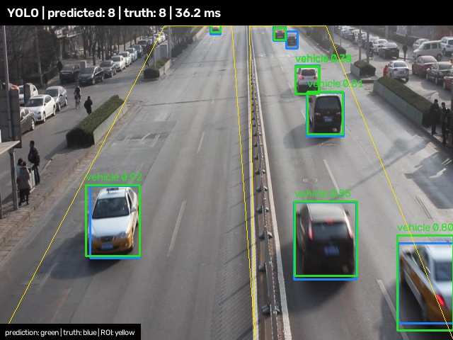

# CNN vs Rule-Based Object Counter

This repository implements a Raspberry Pi 4 experiment comparing two approaches on
annotated images from a real conveyor:

1. YOLO26n inference through ONNX Runtime on the CPU.
2. Traditional OpenCV color thresholding, morphology, and contour detection.

Both modes receive the same normalized images and return the same bounding-box
contract. Their boxes and per-image object counts are evaluated against the
provided annotations. See [PROJECT_PLAN.md](PROJECT_PLAN.md) for the complete
experimental protocol.

OpenCV review frames additionally show each accepted foreground contour as a
translucent orange region. This is the exact contour from which OpenCV derives
the green bounding box, making the rule-based segmentation visibly distinct
from YOLO's direct box predictions.

The first working version is implemented. It loads Edge Impulse annotations,
runs either backend, calculates shared detection/count metrics, writes annotated
images, and creates an MP4 review sequence from the still-image test split.

## Dataset

The baseline input is Edge Impulse's
[Cubes on conveyor belt (colors)](https://docs.edgeimpulse.com/datasets/image/cubes-on-conveyor-belt-colors)
object-detection dataset. It contains real, top-down conveyor images with
clearly separated blue, green, red, and yellow cubes on a dark belt. The source
dataset is licensed under
[BSD 3-Clause Clear](https://spdx.org/licenses/BSD-3-Clause-Clear.html).

For reproducible deployment, the downloader uses Edge Impulse's
[Hugging Face mirror](https://huggingface.co/datasets/edgeimpulse/cubes-on-conveyor-belt)
at commit
[`e3d1c8b`](https://huggingface.co/datasets/edgeimpulse/cubes-on-conveyor-belt/commit/e3d1c8b0c4872b70fcd77d86dec3bde7875e6054).
The pinned snapshot has:

| Property | Value |
|---|---:|
| Images | 70 |
| Training images | 55 |
| Testing images | 15 |
| Bounding boxes | 156 |
| Objects per image | 1–4 |
| Source labels | `blue`, `green`, `red`, `yellow` |
| Evaluation label | `cube` (all colors combined) |

### Example data image

The following downloaded training image has four annotated, spatially
separated cubes. Its ground-truth count is **4**.


Image source: Edge Impulse, *Cubes on conveyor belt (colors)* dataset. A local
copy is included only as a documented preview; the complete dataset is fetched
during deployment.

### Deployment download

The complete dataset is not committed to this repository. Install Git LFS and
run the pinned downloader:

```bash
sudo apt-get update
sudo apt-get install -y git git-lfs
git lfs install

python3 scripts/download_dataset.py
```

No account or API key is required. The command downloads the exact pinned
revision, verifies all image/annotation pairs, checks that LFS images were
materialized, and confirms the expected splits, classes, and box count. It
writes non-secret provenance metadata to:

```text
datasets/cubes-on-conveyor-belt/.source.json
```

The command is idempotent: an existing valid dataset is checked and reused.
Dataset facts and limitations are versioned in
[`data/dataset_sources.json`](data/dataset_sources.json), and attribution is in
[THIRD_PARTY_NOTICES.md](THIRD_PARTY_NOTICES.md).

## Ground truth and metrics

Each split contains a `bounding_boxes.labels` JSON manifest. For a given image,
the number of objects in its `boundingBoxes[filename]` array is the true cube
count. Color labels are collapsed to a single `cube` class for a fair comparison
because the experiment measures object detection and counting, not color
classification.

This supports:

- bounding-box precision, recall, F1, and mAP;
- mean absolute count error per image;
- percentage of images with an exactly correct count;
- total predicted boxes versus total ground-truth boxes;
- median/P95 latency and sustained images per second.

The annotations are independent of both detector outputs, so neither method
defines its own truth.

## Limitations

These are annotated still images, not a documented ordered video sequence.
They cannot evaluate tracking, line crossings, duplicate temporal counts, or
video playback FPS. The first application version will output annotated images
and a metrics summary.

The 15-image testing split is appropriate for a smoke benchmark but too small
for a strong general claim. Several images also appear to come from related
capture sequences, so the published split may contain near-neighbor leakage.
Report this limitation and use a larger, capture-grouped held-out set before
publishing definitive accuracy conclusions.

## PC setup

Use a 64-bit Python 3.11 or newer environment. The runtime project installs
ONNX Runtime CPU, headless OpenCV, NumPy, and PyYAML. The `dev` extra adds only
the test dependency; the substantially larger `train` extra is required only
on the development PC that trains or exports a model.

Linux/macOS:

```bash
python3 -m venv .venv
.venv/bin/python -m pip install --upgrade pip
.venv/bin/python -m pip install -e ".[dev]"
.venv/bin/python scripts/download_dataset.py
```

Windows PowerShell:

```powershell
py -3.11 -m venv .venv
.\.venv\Scripts\python.exe -m pip install --upgrade pip
.\.venv\Scripts\python.exe -m pip install -e ".[dev]"
.\.venv\Scripts\python.exe scripts\download_dataset.py
```

The commands above are correct for inference and testing on a PC. Install
`.[dev,train]` instead when the PC must run `scripts/train_yolo.py` or
`scripts/export_yolo26_vehicle.py`. Training and ONNX export are not Raspberry
Pi setup steps.

## Raspberry Pi setup and complete benchmark

Use 64-bit Raspberry Pi OS on the Raspberry Pi 4 with Python 3.11 or newer. A
32-bit OS is rejected because the standard ONNX Runtime Python installation is
not supported by this deployment script. Active cooling and a stable power
supply are recommended for repeatable timing.

Before starting, copy the repository, both complete annotated datasets, and
both previously exported ONNX files to these paths:

```text
datasets/cubes-on-conveyor-belt/       # includes testing/bounding_boxes.labels
datasets/vehicle-coco-examples/        # includes val images and COCO annotations
models/yolo26n-cube.onnx
models/yolo26n-coco.onnx
```

Then run one command from anywhere inside or outside the repository:

```bash
./scripts/run_raspberry_pi_benchmarks.sh
```

The script installs `python3-venv` through Raspberry Pi OS's package manager if
needed, creates `.venv-rpi`, upgrades pip, installs only the inference
dependencies, validates that the pre-uploaded inputs exist, and runs these four
cases at 640×480:

1. cubes with OpenCV color segmentation;
2. cubes with the trained YOLO26n cube ONNX model;
3. road vehicles with OpenCV MOG2;
4. road vehicles with the pretrained COCO YOLO26n ONNX model.

It never calls a dataset downloader, training script, or model exporter. Each
run uses `--metrics-only`, so frame rendering, JPEG writing, and MP4 encoding
are all skipped. A timestamped directory under `results/raspberry-pi/` contains
only reproducibility metadata plus `summary.json` and `results.csv` for each of
the four cases:

```text
results/raspberry-pi/<UTC timestamp>/
├── environment-before.txt
├── environment-after.txt
├── cubes/{opencv,yolo}/{summary.json,results.csv}
└── road/{opencv,yolo}/{summary.json,results.csv}
```

The Pi still needs internet access on its first run to install Python packages;
the datasets and weights are not downloaded. To use a persistent result path,
different Python executable, or different virtual-environment location, set
`RPI_RESULTS_DIR`, `RPI_PYTHON_BIN`, or `RPI_VENV_DIR` before the command.

## Run the OpenCV baseline

```bash
.venv/bin/python app.py \
  --mode opencv \
  --dataset datasets/cubes-on-conveyor-belt \
  --split testing
```

Outputs are written to `results/opencv-testing/`:

- `summary.json` — aggregate detection, count, and timing metrics;
- `results.csv` — per-image counts and detector latency;
- `images/` — annotated test images;
- `opencv-testing-review.mp4` — two seconds per annotated image.

The MP4 is only a convenient visual review of still-image results. Its playback
rate is not a video-inference FPS measurement.

## Train and run YOLO26n

Training is done on a development machine, never on the Raspberry Pi. The
script converts only the source `training` split to YOLO format, makes a
deterministic 44/11 train/validation split, fine-tunes YOLO26n, and exports the
default end-to-end ONNX output at 640×480.

```bash
.venv/bin/pip install -e ".[train]"
.venv/bin/python scripts/train_yolo.py --epochs 50
.venv/bin/python app.py \
  --mode yolo \
  --dataset datasets/cubes-on-conveyor-belt \
  --split testing
```

The trained weights are intentionally not committed. The expected inference
model path is `models/yolo26n-cube.onnx`.

## Current smoke-test result

The initial implementation check below used the frozen 15-image public test
split and a 50-epoch YOLO26n run. Timings are from the development environment,
not a Raspberry Pi 4, so they are only implementation checks.

| Metric | OpenCV | YOLO26n ONNX |
|---|---:|---:|
| True positives / ground truth | 35 / 35 | 33 / 35 |
| Precision | 100% | 89.2% |
| Recall | 100% | 94.3% |
| F1 | 100% | 91.7% |
| Exact-count images | 15 / 15 | 11 / 15 |
| Mean absolute count error | 0.000 | 0.267 |
| Mean matched IoU | 0.825 | 0.923 |
| Median detector latency | 2.12 ms | 29.84 ms |
| Detector throughput | 465.9 images/s | 29.3 images/s |

### Cube visualization

The matched frame below makes the methods visually distinct. OpenCV overlays
the accepted color-segmentation contours in orange before deriving the green
boxes. YOLO predicts the green boxes directly and therefore has no region
overlay. Blue boxes are ground truth.



Run the actual performance benchmark again on the Raspberry Pi; do not compare
the development-machine latency numbers against future Pi measurements.

## Tests

```bash
.venv/bin/python -m pytest -q
```

For any individual benchmark, `--metrics-only` produces the same JSON and CSV
metrics without creating annotated images or a review video.

## Road-vehicle experiment

The second experiment deliberately moves beyond the controlled cube scene. It
uses PaddleX's small COCO-format vehicle example derived from the
[UA-DETRAC road-traffic benchmark](https://arxiv.org/abs/1511.04136). UA-DETRAC
contains real fixed-camera traffic sequences with vehicle boxes; its full
benchmark has more than 140,000 frames. The compact example used here contains
500 training and 100 validation frames. Only the ordered 100-frame validation
sequence is evaluated.

The application architecture is unchanged:

- both methods receive the same 640×480 frames;
- both methods are evaluated inside the two annotated traffic-lane polygons,
  excluding unannotated parked vehicles;
- both return the existing shared `Detection` box contract;
- the same IoU matcher, per-frame count evaluator, renderer, CSV writer, and
  MP4 writer are reused;
- only the dataset adapter and the OpenCV scene method are selected by
  `configs/road.yaml`.

The two methods are:

1. **YOLO26n ONNX** with pretrained COCO weights and the COCO road classes
   `car`, `motorcycle`, `bus`, and `truck`. It is **not fine-tuned** on
   UA-DETRAC.
2. **OpenCV MOG2** background subtraction, shadow removal, morphology, and
   contour filtering. This is intentionally a simple fixed-camera baseline.

This is a useful counterexample to the cube result. Vehicle appearance, scale,
occlusion, and stopped/slow traffic are semantic problems. Motion subtraction
can be fast, but it can merge nearby cars, fragment a car, or absorb a stopped
car into the background.

### Example result

The matched frames below come from validation image
`MVI_20033__img00056.jpg`. Blue boxes are ground truth, green boxes are
predictions, and the yellow polygons define the two evaluated traffic lanes.
There are eight annotated vehicles in the regions of interest.

**OpenCV MOG2 — 4 predicted / 8 ground truth**



**YOLO26n ONNX — 8 predicted / 8 ground truth**



### Measured results

The following results were produced on the same 100 ordered validation frames
at 640×480. Predictions were matched to ground truth at IoU 0.50. Timings are
detector-only measurements from the development CPU, not Raspberry Pi 4
measurements.

| Metric | OpenCV MOG2 | YOLO26n ONNX |
|---|---:|---:|
| Ground-truth boxes | 584 | 584 |
| Predicted boxes | 275 | 481 |
| True positives | 157 | 459 |
| False positives | 118 | 22 |
| False negatives | 427 | 125 |
| Precision | 57.1% | 95.4% |
| Recall | 26.9% | 78.6% |
| F1 | 36.6% | 86.2% |
| Mean matched IoU | 0.679 | 0.828 |
| Exact-count frames | 9 / 100 | 26 / 100 |
| Mean absolute count error | 3.23 | 1.23 |
| Total absolute count error | 323 | 123 |
| Median detector latency | 3.05 ms | 37.14 ms |
| P95 detector latency | 3.83 ms | 63.90 ms |
| Detector throughput | 322.4 images/s | 24.4 images/s |

YOLO26n improved F1 by **49.6 percentage points** and reduced mean absolute
count error by **61.9%**, despite using pretrained COCO weights without
fine-tuning. OpenCV was approximately **13.2× faster**, but missed many stopped,
overlapping, and low-contrast vehicles. This reverses the controlled cube
result: classical vision excels when appearance and background are tightly
constrained, while the CNN generalizes much better to a complex road scene.

### Run it locally

```bash
.venv/bin/pip install -e ".[dev,train]"
.venv/bin/python scripts/download_road_dataset.py
.venv/bin/python scripts/export_yolo26_vehicle.py

.venv/bin/python app.py \
  --mode opencv \
  --config configs/road.yaml \
  --dataset datasets/vehicle-coco-examples \
  --split val \
  --output results/road-opencv

.venv/bin/python app.py \
  --mode yolo \
  --config configs/road.yaml \
  --dataset datasets/vehicle-coco-examples \
  --split val \
  --output results/road-yolo

.venv/bin/python scripts/compare_results.py \
  --opencv results/road-opencv/summary.json \
  --yolo results/road-yolo/summary.json
```

The outputs include one annotated 10 FPS MP4 per method, per-frame CSV files,
JSON summaries, and a Markdown comparison. The videos show both the predicted
and ground-truth vehicle counts. OpenCV frames also overlay accepted foreground
contours in orange; YOLO frames contain direct neural-network box predictions
without segmentation regions.

The GitHub Actions workflow `.github/workflows/road-benchmark.yml` runs the
same commands on a clean CPU runner and publishes the videos and metrics as one
downloadable artifact.

### Interpretation limits

This remains a per-frame detection/count benchmark, matching the cube
experiment. It does not yet track identities or report the number of unique
cars crossing a line. Adding a shared tracker and line-crossing counter should
be treated as a separate third experiment, because it introduces association
errors beyond detector quality.

The UA-DETRAC-derived sample is published for research benchmarking. Consult
the upstream terms before commercial redistribution; the complete dataset,
weights, and generated videos are not committed here.
